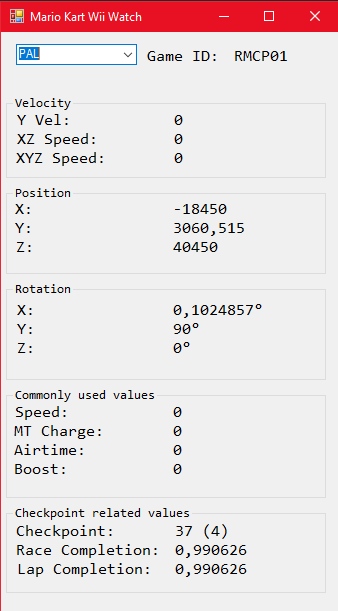

# Mario Kart Wii Watch

This program is able to read variables of Dolphin and displaying them on a window, just like Yoshifan28's [ram-watch-cheat-engine](https://github.com/yoshifan/ram-watch-cheat-engine)

However, his way requires cheat engine with his lua scripts and that affects performance.

# Bugs
Currently this program only works on Dolphin 5.0 stable(or custom dolphin version's based of stable 5.0)
i'm planning to fix this in the future.
